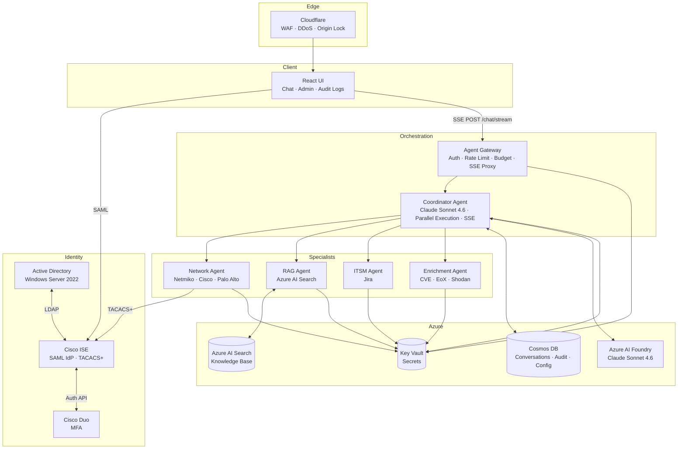
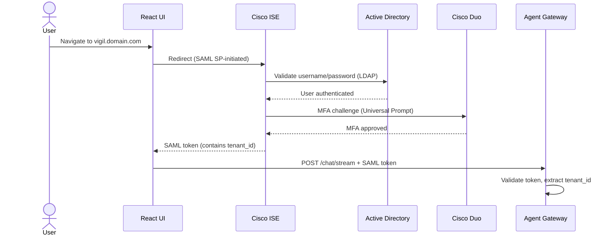
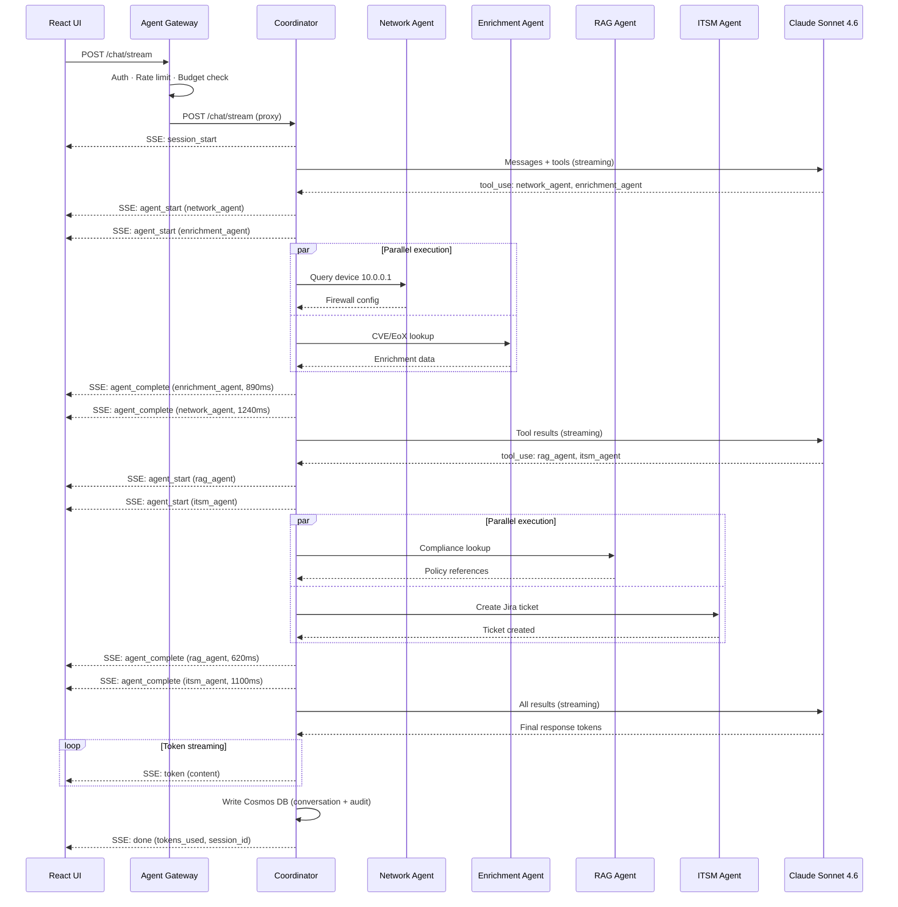
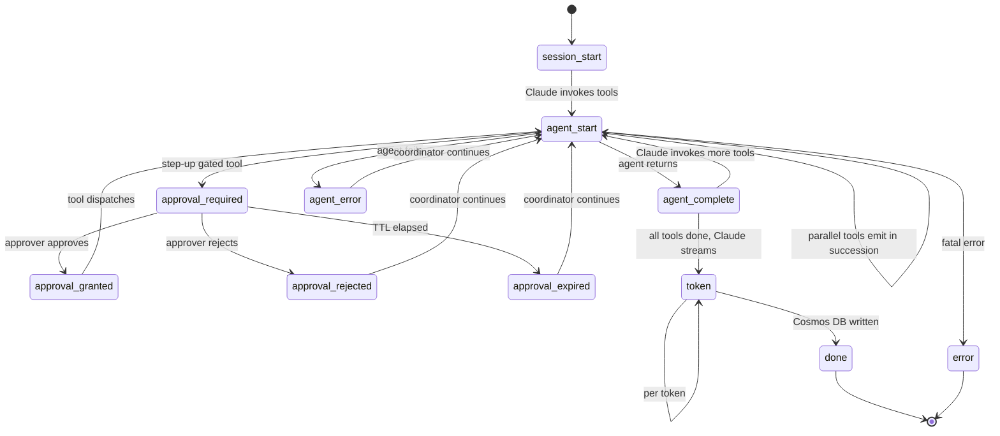
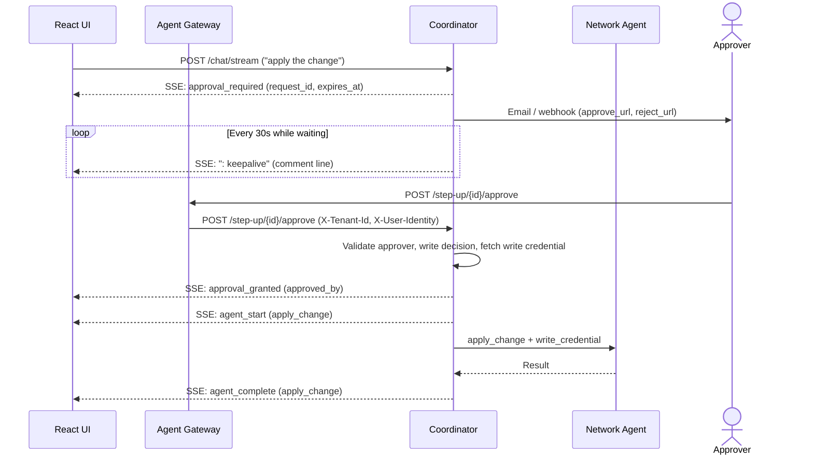
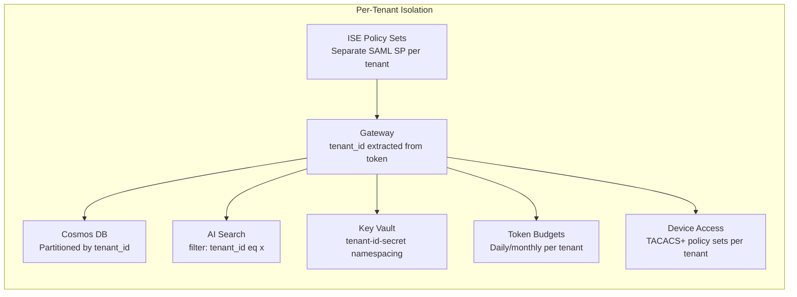
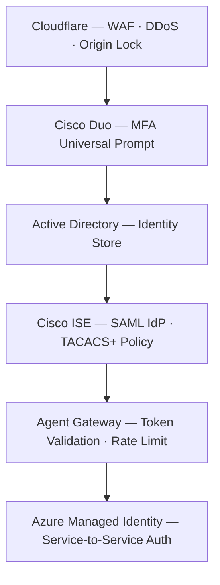

# VIGIL Platform

**Visibility and Intelligence for Governed Infrastructure and Lifecycle**

A multi-tenant, AI-powered managed services platform built on Azure. VIGIL provides AI-driven network auditing, vulnerability enrichment, ITSM integration, and conversational intelligence over client infrastructure — delivered as a Sword Group managed service.

---

## Overview

VIGIL exposes a conversational chat interface backed by a central coordinator agent (Claude Sonnet 4.6) that orchestrates specialist agents across network, security, ITSM, and knowledge domains. All agent activity streams to the user in real time via Server-Sent Events — parallel agent calls are visible as they happen, and the final response streams token by token.

### Key Capabilities

| Capability | Description |
|---|---|
| Network auditing | SSH into Cisco/Palo Alto devices via ISE TACACS+, retrieve config, interfaces, routes, ACLs |
| Network changes | Propose, AI peer review, human approve, apply, and rollback config/state changes — two-phase with full audit trail |
| Step-up auth | Human-in-the-loop approval gates for high-risk tool calls — SSE-streamed, out-of-band email/webhook notifications, time-window grants |
| Vulnerability enrichment | NVD CVE lookup, Cisco EoX lifecycle status, optional Shodan exposure check |
| RAG knowledge base | Azure AI Search over compliance docs, best practices, and policy documents |
| ITSM integration | Create and query Jira tickets from audit findings and every applied network change |
| Real-time streaming | SSE streams agent progress and Claude's response token by token |
| Multi-tenancy | Complete tenant isolation at every layer — auth, data, device access, token budgets |

---

## Architecture

### Platform Layers



### Component Summary

| Component | Type | Purpose |
|---|---|---|
| Cloudflare | SaaS | WAF, DDoS, custom domain, origin locking |
| Active Directory | Azure VM (Windows Server 2022) | Identity store, Group Policy, DNS |
| Cisco ISE | Azure VM (Marketplace) | SAML IdP, TACACS+ device access control |
| Cisco Duo | SaaS + Auth Proxy VM | MFA — Universal Prompt, push/TOTP |
| React UI | Container (Vite) | Chat interface, admin dashboard, audit log viewer |
| Agent Gateway | Container (FastAPI) | Token validation, rate limiting, token budgets, SSE proxy |
| Coordinator Agent | Container (FastAPI + Claude Sonnet 4.6) | Multi-agent orchestration, parallel execution, SSE streaming, step-up approval gates |
| Network Agent | Container (FastAPI + Netmiko) | SSH device interrogation and config/state changes via ISE TACACS+ |
| Change Reviewer Agent | Container (FastAPI + Claude Sonnet 4.6) | AI peer review of proposed network changes — correctness, risk, alternatives |
| RAG Agent | Container (FastAPI) | Azure AI Search knowledge base queries |
| ITSM Agent | Container (FastAPI) | Jira ticket creation and querying |
| Enrichment Agent | Container (FastAPI) | CVE, EoX lifecycle, Shodan lookups |
| Cosmos DB | Azure Native | Conversations, audit logs, tenant config, change records, step-up requests/grants — partitioned by `tenant_id` |
| Azure AI Search | Azure Native | RAG knowledge base with tenant-filtered queries |
| Azure Key Vault | Azure Native | Secrets — fetched at startup via Managed Identity; write credentials fetched just-in-time post step-up approval |
| Azure Communication Services | Azure Native | Out-of-band step-up approval email notifications |
| Azure AI Foundry | Azure Native | Claude Sonnet 4.6 model hosting |

---

## Request Flow

### Authentication



### Multi-Agent Streaming Request



---

## SSE Streaming

VIGIL uses Server-Sent Events for all chat responses. The stream flows Coordinator → Gateway (non-buffered proxy) → React UI.

### SSE Event Schema



| Event | Key Fields | Description |
|---|---|---|
| `session_start` | `session_id`, `tenant_id` | Stream opened |
| `agent_start` | `agent`, `detail` | Agent about to execute (`detail` = device host or null) |
| `agent_complete` | `agent`, `duration_ms` | Agent finished — fires as each completes, not batched |
| `agent_error` | `agent`, `error` | Agent failed — coordinator continues with partial results |
| `approval_required` | `request_id`, `tool`, `context`, `approver_type`, `expires_at` | Step-up gate — loop paused awaiting human approval; keepalive heartbeats sent every 30s |
| `approval_granted` | `request_id`, `tool`, `approved_by` | Approval received, tool dispatching |
| `approval_rejected` | `request_id`, `tool`, `decided_by` | Rejected — coordinator continues with partial results |
| `approval_expired` | `request_id`, `tool` | Approval window elapsed without decision |
| `token` | `content` | One token of Claude's final response |
| `done` | `tokens_used`, `session_id` | Audit log written, stream complete |
| `error` | `code`, `message` | Fatal: `budget_exceeded`, `rate_limited`, `coordinator_unavailable` |

### Parallel Execution

When Claude returns multiple tool calls in a single response, they are independent by definition. The coordinator fans them out with `asyncio.as_completed()` — each agent completion emits its event immediately as it finishes, not after the slowest agent completes.

```
agent_start (network_agent)    ─┐ emitted in
agent_start (enrichment_agent) ─┘ immediate succession

agent_complete (enrichment_agent, 890ms)  ← finished first
agent_complete (network_agent, 1240ms)    ← finished second
```

---

## Step-Up Auth

High-risk tool calls (`apply_change`, `rollback_change`) require human approval before the coordinator dispatches them. The approval loop runs entirely inside the SSE stream — the connection stays open with keepalive heartbeats while waiting.



### Approval policies (per tool, per tenant — in `tenant_config`)

| Policy field | Effect |
|---|---|
| `self_approve: false` | Requester cannot approve their own request — designated approver required |
| `self_approve: true` | Requester can approve (lower-risk tools) |
| `pending_ttl_seconds` | How long the approval window stays open (default 900s) |
| `grant_duration_seconds` | After approval, how long the grant stays active for repeat calls in the same session |

---

## Multi-Tenancy

Every layer enforces tenant isolation:



Non-negotiable rules enforced in every service:
- Every Cosmos DB query uses `tenant_id` as partition key — never cross-tenant queries
- Every Azure AI Search query includes `$filter=tenant_id eq '{tenant_id}'`
- Every Key Vault secret is namespaced: `tenant-{tenant_id}-{secret-name}`
- Every audit log entry includes `tenant_id`
- Token budgets are per-tenant — checked at Gateway before Coordinator is called

---

## Security Model



- **No stored device credentials** — network device access always flows through ISE TACACS+
- **No API keys in code or env vars** — all Azure services use Managed Identity (RBAC scoped to minimum required roles)
- **Cloudflare origin lock** — Azure Container Apps origin accepts only Cloudflare IP ranges
- **ISE logs every device command** — independent TACACS+ audit trail separate from VIGIL audit logs

---

## Technology Decisions

| Decision | Choice | Rationale |
|---|---|---|
| LLM | Claude Sonnet 4.6 via Azure AI Foundry | Azure MACC billing, Entra ID auth, best-in-class reasoning and tool use |
| Agent framework | Custom FastAPI + Claude tool use | Full control, no framework lock-in |
| Streaming | Server-Sent Events (SSE) | One-way server-to-client stream — simpler than WebSockets, sufficient for request/stream-response pattern |
| Parallelism | `asyncio.as_completed()` | Real-time per-agent events as each finishes; no external dependencies |
| UI SSE client | `fetch` + `ReadableStream` | POST support required — browser `EventSource` is GET-only |
| Database | Cosmos DB | Managed NoSQL, native Azure, serverless billing, natural tenant partitioning |
| Vector search | Azure AI Search | Managed RAG, native Foundry integration |
| Container runtime | Azure Container Apps | Managed Kubernetes abstraction, built-in ingress, revision management |
| Identity | AD + ISE + Duo | Enterprise standard stack — ISE SAML IdP + TACACS+ device access |
| Edge | Cloudflare | WAF, DDoS, custom domain, origin locking |
| IaC | Terraform | Industry standard, multi-cloud portability |
| CI/CD | GitHub Actions | Native ACR integration, path-filtered per-service deploys |

---

## Repository Structure

```
vigil-platform/
├── ARCHITECTURE.md              ← detailed architecture reference
├── CLAUDE.md                    ← Claude Code development instructions
├── services/
│   ├── gateway/                 ← FastAPI — auth, rate limiting, SSE proxy
│   ├── coordinator/             ← FastAPI + Claude Sonnet 4.6 — orchestration, streaming
│   ├── agent-network/           ← FastAPI + Netmiko — device interrogation
│   ├── agent-rag/               ← FastAPI — Azure AI Search RAG
│   ├── agent-itsm/              ← FastAPI — Jira integration
│   ├── agent-enrichment/        ← FastAPI — CVE, EoX, Shodan
│   └── ui/                      ← React + Vite — chat UI and admin
├── infrastructure/
│   └── terraform/               ← Azure IaC — modules per resource type
├── .github/
│   └── workflows/               ← GitHub Actions — path-filtered per service
├── identity/
│   ├── ise/                     ← ISE policy exports, TACACS+ command profiles
│   ├── ad/                      ← AD OU structure
│   └── duo/                     ← Duo policy documentation
└── docs/
    ├── onboarding.md
    ├── tenant-setup.md
    └── superpowers/specs/       ← design specs
```

---

## Local Development

```bash
git clone https://github.com/sjohnston1972/vigil-platform
cd vigil-platform

# Run a single service
cd services/coordinator
pip install -r requirements.txt
uvicorn main:app --reload --port 8001

# Run with Docker
docker build -t vigil-coordinator .
docker run -p 8001:8000 --env-file .env vigil-coordinator

# Terraform
cd infrastructure/terraform
terraform init
terraform plan -var-file=environments/dev.tfvars
terraform apply -var-file=environments/dev.tfvars
```

### Required Environment Variables

**Gateway**
```
COSMOS_ENDPOINT
COSMOS_DATABASE
ISE_SAML_METADATA_URL
ISE_SAML_AUDIENCE
COORDINATOR_URL
```

**Coordinator**
```
AZURE_FOUNDRY_ENDPOINT
AZURE_FOUNDRY_MODEL
COSMOS_ENDPOINT
COSMOS_DATABASE
KEY_VAULT_URL
NETWORK_AGENT_URL
RAG_AGENT_URL
ITSM_AGENT_URL
ENRICHMENT_AGENT_URL
GATEWAY_EXTERNAL_URL        # base URL for step-up approve/reject links in notifications
ACS_ENDPOINT                # Azure Communication Services endpoint (step-up emails)
ACS_SENDER_ADDRESS          # noreply address for approval emails
```

All Azure services authenticate via Managed Identity — no API keys required.
